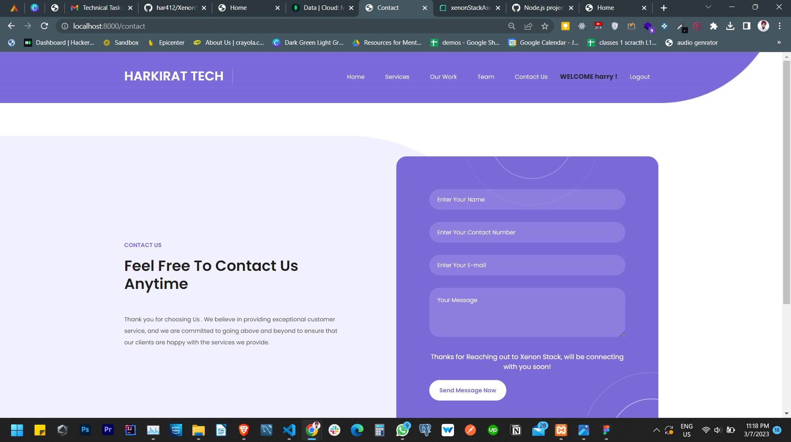

# Xenon Stack Assesment 

This is a Node js application with frontend as HTML , CSS , JS , Bootstrap(for responsiveness) and backend as express and ejs template engine for dynamic data
**Created in Submission for Round 2 of Xenon Stack**.

---
## Requirements

For development, you will only need Node.js and a node global package, NPM, installed in your environement.

### Node

If the installation was successful, you should be able to run the following command.

    $ node --version
    v14.17.3

    $ npm --version
    6.14.13

## Project Set Up  

    
    $ npm install
    

## Running the project

    $ node app.js

# Theme 
##  Rishabh Technologies
- Created a Web App for a Service based Company which offers IT Solutions to Clients.

# Functionalities

## Session Based Authentication with Passport js
- using passport js implemented session based authentication in which sessions were store in Mongo Db in collection named as sessions.

- After successfull login user object can be found in ***req.session.passport.user***

- Thus Showed Name of User in Navbar after Successful login.

- User Registration is implemented to create a new user sucessfully.

## Used Middleware to Ensure All Webpages are locked untill authenticated except Home Page
- Lock Icon is Given to the pages on home page which are locked without login.

## Mongo DB - Atlas is used as a Cloud Database

### 3 Collections are created
- ***Contact form*** --> To store user messages from website
- ***users*** --> To store User Credentials
- ***session*** --> To store/maintain sessions

## Template Engine EJS is used for dynamic rendering
- Used EJS to display the name of user signed In on navbar after sucessfull Login

## Flash Messages for Errors and Warnings While Login/Register.
- Flash messages are implemented to inform user about wrong password, User Already Exist etc.

## Responsive Frontend Using HTML, CSS, JS , Bootstrap

### Home Page

### Our Work Page

### Contact Us

## Contact Us form Stores data in Contact-form Collection in Mongo DB.
- Messages, contact number, email , name are store in Databse and user is given a success message on completion.

# Thanks Would Love to hear Suggestion 
- Rishabh Chandra Lal : rishabhchandralal15@gmail.com
